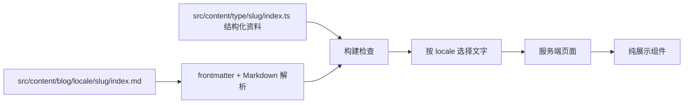

# Sven LI 个人网站架构

本文档定义 React/Next.js 重建版个人网站的业务范围、页面结构、数据流、资源边界和部署约束。视觉与组件参考来自 `references/chanhdai.com`，内容与动画参考来自 `references/Sven-LI-sankyuu.github.io`，实现以本文件的长期约定为准。

## 目标与边界

网站的核心任务是让访问者快速确认“你是谁、研究什么、完成过什么、如何联系”。首页采用 chanhdai.com 的作品集结构承载学术个人主页内容，首屏包含个人身份信息、机构、简介、社交链接和简历下载入口；论文与经历提供支持这些信息的证据。

首期实现浅色/深色主题切换、系统主题默认值、中英文切换、浏览器语言默认值、响应式导航、外部链接、资源下载和 Markdown Blog。项目为项目、演讲和教学保留清楚的扩展位置，真实内容出现后再公开相应入口。网站首期不引入登录、数据库、后台编辑器或动态 API。

## 设计原则

1. **内容先于装饰。** 关闭 JavaScript、动画或外部计数服务后，姓名、研究、论文、经历和联系方式仍可阅读。
2. **一份事实只有一个来源。** 日期、链接、slug 和作者列表只存一份；中英文只复制需要翻译的文字。
3. **公开页面必须有真实内容。** Hugo 模板附带的示例项目、示例演讲、示例博客和示例课程不迁移到生产站点。
4. **今天的代码解决今天的问题。** Blog 使用当前已经确认的 Markdown 文件需求；项目、演讲和教学等能力在真实内容出现时创建对应路由、类型和组件。
5. **依赖必须消除真实风险。** `next-themes` 负责首屏主题闪烁和系统主题变化；普通数据映射与双语文案使用项目内代码。
6. **错误在构建时暴露。** 缺少翻译、重复 slug、无效日期、无效 URL 和找不到的本地资源会让检查或构建失败。
7. **设计来源单一且可追溯。** 能由 `references/chanhdai.com` 的页面结构、排版或基础组件完成的功能，直接复制或适配对应实现；新增组件必须有客观功能缺口，并记录缺口、复用对象和边界。
8. **内容与设计解耦。** 参考项目只提供展示结构和交互形态，个人资料、精选论文、Blog Markdown、OPPO Sans、Matrix、MLP 和计数器均从本项目自己的源文件读取。

## 当前内容基线

首期公开资料包括作者简介、教育与工作经历，以及由用户确认的精选论文和首个项目 `presentation-skills`。当前可公开的真实论文包括 Compliance-to-Code、From Statute to Control Flow、KnowMT-Bench 和 Fedspeak Confidence，最终顺序由当前站点的数据层决定。参考项目中的 Pandas、PyTorch、scikit-learn、Example Talk、模板博客和 Learn Python/JavaScript 属于主题示例，保留在 `references/` 供视觉对照，不进入新站点内容数据。

## 技术决策

| 领域 | 决策 | 原因 |
| --- | --- | --- |
| 框架 | Next.js 16 App Router + React 19 + TypeScript，Node.js `>=22`，pnpm | 对齐 `references/chanhdai.com` 与 Vercel 默认识别，后续可平滑加入服务端能力 |
| 页面生成 | 以静态生成为主，内容来自仓库内的类型化数据 | 个人站点内容变更少，构建结果稳定且易审查 |
| 样式 | Tailwind CSS v4 + shadcn `base-nova` + 全局 CSS 变量 | 直接复用参考项目的排版、语义色和 Base UI 组件，减少自定义样式分叉 |
| 主题 | `next-themes`，`defaultTheme: system` | 处理系统主题、持久化和首屏闪烁 |
| 图标 | `lucide-react` | 导航和操作图标来源统一，具备稳定的可访问用法 |
| 语言 | `/en`、`/zh` locale 路由，`proxy.ts` 协商初始语言 | URL 可分享、可索引，不引入完整 i18n 框架 |
| Blog | `gray-matter` + `react-markdown` + `remark-gfm` | 可靠解析 frontmatter 和 GitHub 风格 Markdown，原始 HTML 默认不执行 |
| 字体 | `OPPO Sans 4.0` 本地字体文件 | 使用 `next/font/local`，避免运行时字体请求 |
| 动画 | 原 HTML 文件作为 `public/backgrounds/*.html`，由 iframe 加载 | 保持 Matrix 和 MLP 动画完整，隔离 Three.js/Canvas 对主页面的影响 |
| 访问计数 | `https://count.getloli.com/@Sven-LI-sankyuu?...` 图片 | 保留参考站点已有计数器和展示主题 |
| Next.js AI 规则文件 | `agentRules: false` | 仓库已经有自己的 `AGENTS.md`，关闭 Next.js 自动生成和解析 AI 规则文件，避免开发模式误读项目说明 |
| 部署 | Vercel 默认 Next.js 构建 | 不依赖 Hugo、Netlify 配置或自定义服务器 |

## 页面与导航

locale 是所有页面的第一段路径；根路径由 Next.js 16 的 `proxy.ts` 根据 `NEXT_LOCALE` cookie、`Accept-Language` 和默认语言 `en` 依次选择并重定向。

| 路径 | 发布阶段 | 页面职责 |
| --- | --- | --- |
| `/en`、`/zh` | 首期 | 个人简介、研究方向、精选论文前五条、经历前五条和完整页入口 |
| `/en/experience`、`/zh/experience` | 首期 | 完整工作经历、教育经历，以及后续技能、语言、奖项和项目关联 |
| `/en/publications`、`/zh/publications` | 首期 | 完整精选论文列表，包含更长摘要、作者、发表信息、论文/代码/数据链接 |
| `/en/publications/[slug]`、`/zh/publications/[slug]` | 首期 | 单篇论文的摘要、作者、出版信息、论文/代码/数据链接 |
| `/en/blog`、`/zh/blog` | 首期 | 当前语言的已发布文章列表 |
| `/en/blog/[slug]`、`/zh/blog/[slug]` | 首期 | Markdown 文章正文、日期、标签和可选封面 |
| `/en/feed.xml`、`/zh/feed.xml` | 首期 | 当前语言已发布文章的 RSS 订阅 |
| `/en/projects`、`/zh/projects` | 首期 | 个人项目列表、项目简介和外部项目链接 |
| `/en/talks`、`/zh/talks` | 出现真实演讲时 | 演讲和活动列表 |
| `/en/teaching`、`/zh/teaching` | 出现真实教学内容时 | 课程与教学材料 |

首期导航包含 Bio、Papers、Projects、Experience、Blog 和 CV。Blog 尚无已发布文章时隐藏导航项，作者把任一 Markdown 的 `draft` 改为 `false` 后，下一次构建自动启用入口。后续页面与导航项在同一次改动中启用，避免空入口。导航文字由 locale 文案提供，主题和语言控件使用图标按钮并提供可访问名称。

## 页面组成

首期首页由以下稳定区块组成：

1. `SiteHeader`：固定或吸顶导航、品牌文字 `Siyuan LI`、语言切换、主题切换。
2. `BiographyHero`：头像、姓名 `Siyuan (Sven) LI`、职位 `Mphil Student`、机构 HKUST(GZ)、简介、社交链接、`Download CV`。
3. `ResearchIntro`：研究方向为 LLM Agent、Knowledge Graph、NLP Financial Applications、Auto-Financial Researching。
4. `PublicationList`：经用户确认的精选论文适配参考 `Projects`/`ProjectItem` 的列表结构和交互，首页只显示前五条；超出五条时显示省略行和完整页入口，未超出五条时保留完整页入口。
5. `ProjectsList`：个人项目列表，首页只显示首个确认项目 `presentation-skills`，并提供完整页入口。
6. `SiteFooter`：访问计数器、字体声明和版权。

`BiographyHero` 内嵌 Matrix 动画背景。MLP 动画保留为可用资源，但默认不作为全站背景挂载，避免首页视觉噪声压过文字内容。正文层必须拥有独立堆叠上下文和实色/半透明背景，确保动画不会覆盖文字、链接或焦点状态。

首页的 Experience 区块只展示前五条工作经历并提供完整页入口；教育经历可以继续作为首页的短证明区块显示。`/experience` 页面负责完整记录，后续新增技能、语言、奖项或项目关联时先进入该页面，再决定是否需要首页摘要。

## 视觉契约

**参考对象。** `references/chanhdai.com` 是页面结构、排版、细线、区块间距、卡片密度和交互状态的唯一优先视觉基准；`references/Sven-LI-sankyuu.github.io` 只提供个人内容线索、Matrix/MLP 动画和计数器来源。新站沿用 chanhdai.com 的作品集外壳，再填入本项目的学术主页内容。

**主题关系。** 深色主题和浅色主题共享参考项目的布局、尺寸、强调色和语义变量；主题切换只改变语义颜色，不移动内容或改变图片尺寸。

**验收方法。** 首轮页面完成后同时截取参考站点与新站的桌面、移动画面，比较首屏占比、标题层级、留白、卡片密度和下一分区露出。差异必须源于双语、响应式或可访问性需求。

## 参考组件复用契约

`docs/references/chanhdai-com.md` 是参考项目的定点索引。实现页面时优先读取索引列出的入口、组件和样式文件，避免扫描整个参考仓库。复用顺序固定为：页面外壳与区块结构、排版与语义色、基础 UI 原语、现有复合组件、最后才是本项目新增组件。

首期明确复用 `Panel`、`ProfileHeader` 的信息层级、`Overview`、`SocialLinks`、`Experiences`、`Education`、`Timeline`、Blog 的 `PostList`/`PostItem`/`PostSearchInput`、文章的 `DocLayout`/`DocPageRoot`、`Prose` 以及 `screen-line-*` 和 `stripe-divider` 工具类。复用时只替换内容接口、locale 路径、个人品牌和数据来源，不复制参考项目的个人资料、registry、赞助、统计和品牌资产。

语言切换、Matrix/MLP 动画包装器和访问计数器属于当前客观缺口。精选论文完整页、Projects 完整页和 Experience 完整页已经纳入首期页面，它们只复用现有布局，不重新定义交互模型。新增组件必须保持小边界：语言控件只处理 locale 路径与偏好，动画包装器只处理 iframe 生命周期与层级，计数器只处理外部图片状态，论文、项目与经历列表只把内容数据映射到参考 `Projects` 列表密度。新增组件不得重新定义参考项目已有的布局或按钮样式。

参考项目代码按 MIT License 使用，并保留许可声明；`TRADEMARK.md` 排除 `chanhdai`/`ncdai` 名称、wordmark、mark、头像、肖像和易造成归属误认的品牌呈现。OPPO Sans 替换参考项目字体，Matrix、MLP 和计数器继续使用原个人站点资源。

## 数据流与模型

每种业务内容拥有独立目录：`src/content/profile/`、`experience/`、`publications/`、`blog/`、`talks/`、`projects/` 和 `teaching/`。Profile、Experience 和 Publication 属于结构化资料，使用类别目录下的 `index.ts`；Blog 属于手工创作的长文，使用 `<locale>/<slug>/index.md`。界面文案属于界面层，放在 `src/i18n/messages.ts`。页面只接收当前 locale 已解析的数据，组件不读取文件、不判断草稿、不拼接业务 URL。



首期只定义页面实际使用的模型：

```ts
type Locale = 'en' | 'zh'
type LocalizedText = Record<Locale, string>

type Profile = {
  name: string
  displayName: LocalizedText
  role: LocalizedText
  organization: { name: string; href: string }
  email: string
  avatar: string
  summary: LocalizedText
  interests: LocalizedText[]
  profiles: { github?: string; linkedin?: string; scholar?: string }
}

type Experience = {
  title: LocalizedText
  organization: LocalizedText
  start: string
  end?: string
  summary: LocalizedText
  href?: string
}

type Publication = {
  slug: string
  title: LocalizedText
  summary: LocalizedText
  abstract: LocalizedText
  authors: string[]
  date: string
  venue: string
  order: number
  cover?: string
  links: { paper?: string; code?: string; dataset?: string }
}

type Project = {
  slug: string
  title: LocalizedText
  summary: LocalizedText
  description: LocalizedText
  link: string
  tags: string[]
  order: number
}
```

`src/content/publications/` 只收录精选论文，每篇论文的 `index.ts` 同时保存双语文字和不随语言变化的共享事实，`order` 表达显示顺序。`src/content/projects/` 只收录确认过的个人项目，每个项目保存双语摘要、简述、标签和外部链接。教育沿用 `Experience` 的时间线形状，技能与语言使用简单数组。`Talk` 和 `Teaching` 在出现真实数据时再选择合适的源文件格式；Blog 始终使用普通 Markdown，不引入 MDX。

`src/lib/content/validate.ts` 使用项目内断言检查双语文字非空、slug 唯一、论文 `order` 唯一、ISO 日期有效、URL 可解析、本地图片存在。Blog 同名译文的 `date`、`tags`、`draft` 和 `cover` 必须一致，避免共享事实漂移。检查函数在测试和生产构建前执行，不引入 schema 库。

## Blog 内容契约

Blog 的作者入口是 `src/content/blog/`，每个语言版本由一个普通 Markdown 文件完整表达。目录名决定语言，文章目录名决定 URL slug；中文文章使用 `src/content/blog/zh/<slug>/index.md`，英文文章使用 `src/content/blog/en/<slug>/index.md`。同一文章需要翻译时，在另一语言目录建立同名目录和文件。

```markdown
---
title: "文章标题"
summary: "用于列表和搜索引擎的简短摘要"
date: "2026-08-10"
updated: "2026-08-10"
tags: ["LLM", "Finance"]
draft: false
cover: "/assets/blog/example/cover.jpg"
---

正文使用普通 Markdown，可包含标题、列表、链接、引用、表格、任务列表、图片和代码块。
```

`title`、`summary`、`date`、`tags` 和 `draft` 为必填字段，`updated` 与 `cover` 可省略。slug 目录名只允许小写字母、数字和连字符；同一 locale 内 slug 必须唯一。文章图片放在 `public/assets/blog/<slug>/`，中英文版本共享该资产目录，语言专用图片通过文件名区分。Markdown 使用以 `/assets/blog/` 开头的绝对路径。

构建过程读取文件、解析 frontmatter、校验元数据并生成静态页面。`draft: true` 的文章不会进入列表、详情静态参数、RSS 或 sitemap。详情页只渲染 Markdown 语法，MDX、脚本和原始 HTML 不执行。语言切换在同名翻译存在时进入译文，缺少译文时进入目标语言的 Blog 列表并清楚保留原文链接。

## 主题与语言流程

```mermaid
flowchart LR
  Browser[浏览器] --> Proxy[proxy.ts]
  Proxy --> Cookie{NEXT_LOCALE cookie?}
  Cookie -->|有| LocaleRoute[/en 或 /zh]
  Cookie -->|无| Accept[Accept-Language]
  Accept --> LocaleRoute
  LocaleRoute --> Page[静态页面 + locale 文案]
  Theme[ThemeProvider] --> Page
  LocaleToggle[语言控件] --> Cookie
  ThemeToggle[主题控件] --> ThemeStore[localStorage]
```

主题状态只有 `system`、`light`、`dark` 三种，`next-themes` 负责系统主题监听、首屏 class 和本地持久化。颜色只通过 `:root` 和 `.dark` CSS 变量定义，组件内不判断主题。语言切换保留当前 pathname 的 slug，写入 `NEXT_LOCALE` cookie 后切换 locale 段；`proxy.ts` 只负责无 locale 的入口重定向，页面翻译读取普通 TypeScript 对象。

## 动画与计数器资源

`references/Sven-LI-sankyuu.github.io/assets/media/matrix-transform-bg.html` 和 `mlp-bg.html` 是首期动画源文件。实现阶段复制到 `public/backgrounds/`，URL 固定为 `/backgrounds/matrix-transform-bg.html` 与 `/backgrounds/mlp-bg.html`。一个小型客户端组件在用户允许动态效果时渲染 iframe；iframe 设置 `title`、`aria-hidden="true"`、`pointer-events: none` 和零边框，父层只控制位置与透明度。当前页面只挂载 Matrix，MLP 作为后续局部装饰候选资源保留。两个 HTML 动画都接收 `theme=light|dark` 查询参数，并在没有参数时读取系统主题；浅色版本使用中性背景、灰黑网格和文字，深色版本保留暗色背景与低透明线条。MLP 使用文件内的 Three.js CDN，后续可以在保持 iframe URL 的条件下改为本地依赖。

计数器使用原参数：用户名 `@Sven-LI-sankyuu`、名称 `Sven-LI-sankyuu`、主题 `moebooru`、`padding=7`、`pixelated=1`、`darkmode=auto`。计数器通过原生 `` 由浏览器直接请求，并链接到 `https://count.getloli.com/`；探测结果显示普通命令行请求返回 HTTP 403，带浏览器 User-Agent 和站点 Referer 的请求返回 HTTP 200 与 SVG 图片，因此实现中不经过 Next.js 图片优化代理。加载失败时显示明确的不可用状态并记录控制台错误，页面主体仍可正常使用。

## 字体与许可

字体包 `temp/OPPO_Sans_4.0(3).zip` 内含约 22.7 MB 的 `OPPO Sans 4.0.ttf` 和许可声明。实现时复制字体文件及许可声明到 `public/fonts/`，通过 `next/font/local` 注册，不修改字体文件，并设置 `display: swap` 与 `preload: false`，保证大字体文件不会阻塞首屏内容。该许可只允许分发未修改的字体副本，因此首期不做子集化或格式转换。网站页脚和字体目录保留 OPPO Sans 版权及许可声明。

## 工程目录约定

```text
src/
  app/
    [locale]/page.tsx
    [locale]/experience/page.tsx
    [locale]/publications/[slug]/page.tsx
    [locale]/blog/page.tsx
    [locale]/blog/[slug]/page.tsx
    [locale]/feed.xml/route.ts
    layout.tsx
    globals.css
    sitemap.ts
    robots.ts
  components/          # 优先适配 chanhdai.com 的布局、基础 UI 和少量客户端控件
    ui/                # 参考项目 base-nova/Base UI 组件的本地副本或适配层
  styles/
    globals.css         # Tailwind v4、主题变量和全局工具类
    typeset.css         # 参考项目排版变量与文章样式的适配
  content/
    profile/index.ts   # 姓名、机构、简介、社交链接
    experience/index.ts # 教育、工作、技能和语言
    publications/
      <slug>/index.ts  # 一篇精选论文的双语资料与共享事实
    projects/index.ts  # 确认过的个人项目与展示摘要
    blog/
      zh/<slug>/index.md # 中文文章真源
      en/<slug>/index.md # 英文文章真源或译文
    talks/             # 真实演讲出现时定义内部格式
    teaching/          # 真实教学内容出现时定义内部格式
  i18n/
    messages.ts        # 导航、按钮、状态等双语界面文案
    locale.ts          # locale 判断、路径切换和文案选择
  config/site.ts       # 生产域名、计数器标识和公共资源路径
  lib/content/
    markdown.ts        # 唯一的文件读取与 Markdown 解析入口
    blog.ts            # Blog 查询和 frontmatter 校验
    validate.ts        # 跨类别构建检查
  proxy.ts             # Next.js 16 初始语言协商
public/
  assets/
    profile/           # 头像和个人相关媒体
    publications/<slug>/ # 论文图片、海报和附件
    blog/<slug>/        # Blog 封面和正文图片
    talks/<slug>/       # 未来的演讲媒体
    projects/<slug>/    # 未来的项目媒体
    teaching/<slug>/    # 未来的教学媒体
  backgrounds/         # 动画 iframe 的公开 HTML
  fonts/               # OPPO Sans 字体和许可声明
  downloads/           # resume.pdf 等公开下载文件
```

`talks` 和 `teaching` 的路由目录在相应内容确认后创建。Blog 路由首期实现，公开导航由已发布文章数量决定。首期目录不放占位文章或“Coming Soon”页面。

内容真源与公开资产按同一类别和 slug 对齐：TypeScript 与 Markdown 真源只在 `src/content/`，浏览器直接访问的图片、海报和附件只在 `public/assets/`。动画、字体和下载文件拥有独立的公共目录，页面组件通过明确的 URL 引用它们。

`src/config/site.ts` 只保存跨页面稳定配置，包括生产站点 origin、计数器名称和动画/下载公共路径。个人姓名、论文信息和界面文案仍由各自内容层负责，配置文件不复制业务内容。

| 类别 | 真源目录 | 公共资产目录 | 首期状态 |
| --- | --- | --- | --- |
| Profile | `src/content/profile/index.ts` | `public/assets/profile/` | 使用 |
| Experience | `src/content/experience/index.ts` | `public/assets/experience/` | 使用 |
| Publications | `src/content/publications/<slug>/index.ts` | `public/assets/publications/<slug>/` | 精选名单使用 |
| Projects | `src/content/projects/index.ts` | `public/assets/projects/` | 首期使用，媒体按需定义 |
| Blog | `src/content/blog/<locale>/<slug>/index.md` | `public/assets/blog/<slug>/` | 使用 |
| Talks | `src/content/talks/` | `public/assets/talks/<slug>/` | 按需定义 |
| Teaching | `src/content/teaching/` | `public/assets/teaching/<slug>/` | 按需定义 |

## 性能、可访问性与验证

内容页面使用服务端组件和静态生成，`src/lib/content/` 的 loader 导入 `server-only`，防止文件系统代码进入客户端包。客户端代码只承担主题控件、语言偏好写入和 reduced-motion 下的动画挂载；计数器使用服务端输出的原生 ``，失败时由替代文字明确表示不可用。动画不参与内容布局，移动端根据截图结果调整透明度；`prefers-reduced-motion: reduce` 时不加载 iframe。图片提供稳定尺寸、替代文字和懒加载；外部链接设置 `rel="noreferrer"`；所有控件具备键盘焦点和可读标签。

每次改动至少运行内容校验、`pnpm lint`、`pnpm build`，并用 Playwright 检查桌面和移动视口的首页、Blog 列表与正文、主题切换、语言切换、导航锚点、动画 iframe 与计数器。构建失败、locale 文案缺失、Blog frontmatter 无效、动态 slug 不存在都应直接暴露错误。

## 搜索引擎与分享

每个公开页面通过 Next.js Metadata API 输出对应语言的 title、description、canonical URL、`hreflang` alternates 和 Open Graph 信息。Blog 的 metadata 直接读取 Markdown frontmatter，只在同名译文存在时输出对应 `hreflang`。`sitemap.ts` 枚举实际公开的 locale 页面、精选论文和非草稿文章，`robots.ts` 允许生产站点抓取，`/<locale>/feed.xml` 从同一语言的文章查询生成 RSS。个人姓名、机构、论文作者和外部论文地址直接来自内容数据，元数据层不维护第二份副本。

## 决策记录

**2026-08-10，保留未来能力但延迟实例化。** 项目、演讲和教学仍属于网站长期范围；真实内容出现前不创建路由、类型和组件。Blog 已进入首期，因为 Markdown 手工写作是当前明确需求。

**2026-08-10，论文使用显式精选名单。** 公开范围与顺序由用户确认，内容真实性作为入选的必要条件。

**2026-08-10，首期不使用通用内容基类、MDX 和完整 i18n 框架。** 当前内容用三个具体模型和普通 TypeScript 文案表达；未来需求达到触发条件后再增加相应工具。

**2026-08-10，Blog 使用一文件一语言版本。** 普通 Markdown 是文章真源，文章目录提供 slug，父目录提供 locale；可选翻译使用另一语言目录下的同名文章目录。

**2026-08-10，内容统一分类但保留合适格式。** Blog 使用 locale 与 slug 分层的 Markdown；Publication 使用每篇一个 `index.ts` 保存双语文字和共享事实；界面文案归入 `src/i18n/`，公开媒体归入 `public/assets/<type>/<slug>/`。

**2026-08-10，参考项目作为强制设计来源。** 页面结构、排版、基础 UI 和可复用复合组件优先来自 `references/chanhdai.com`；索引见 `docs/references/chanhdai-com.md`。自定义组件只处理语言路径、两个动画、访问计数器和精选论文字段等客观缺口，并记录复用关系与边界。

**2026-08-10，样式栈对齐参考项目。** 项目采用 Tailwind CSS v4、shadcn `base-nova`、Base UI 原语和 CSS 变量，主字体使用 OPPO Sans；本记录更新此前的局部样式方案。

**2026-08-11，首页改为概览，完整页承担细节。** Profile 首页保留当前视觉结构，但 Selected publications 和 Experience 只显示前五条，并提供完整页入口；`/publications` 展示完整精选论文列表和更长摘要，`/experience` 展示完整工作与教育经历。MLP 动画保留为资源但默认不挂到全站背景，Matrix 与 MLP 的 HTML 文件都支持浅色和深色主题参数。
